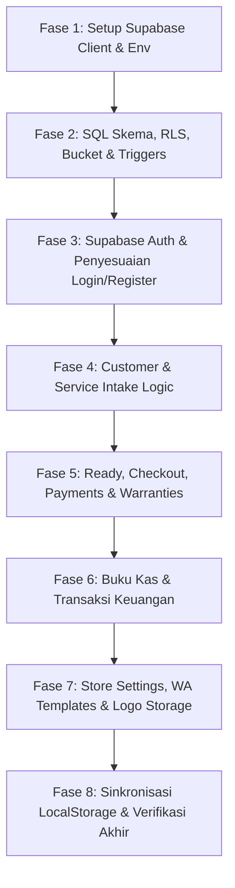

# STEP-BY-STEP IMPLEMENTATION PLAN: ORDO V0 TO SUPABASE PRODUCTION

Rencana ini memecah proses migrasi **Ordo V0** dari *localStorage / in-memory state* ke **Supabase (PostgreSQL, Supabase Auth, dan Supabase Storage)** menjadi 8 fase kecil yang aman, berurutan, dan dapat diverifikasi di setiap langkahnya tanpa mengubah UI, UX, teks, responsive layout, maupun alur bisnis V0.

> [!IMPORTANT]
> **ATURAN EKSEKUSI**:
> Eksekusi tidak akan dimulai sebelum Anda meninjau dokumen rencana ini dan memberikan instruksi spesifik: **"Mulai Fase 1"**. Setiap fase akan dieksekusi dan diverifikasi secara bertahap.

---

## Ringkasan Penyesuaian Sesuai Keputusan Anda
1. **Pengecualian Form Registrasi**: Input "Username Toko" dihapus dari form pendaftaran.
2. **Form Login**: Hanya meminta **Email** dan **Kata Sandi**.
3. **URL Routing & Slug Toko**: Kolom `username` di tabel `stores` tetap ada untuk routing URL (contoh: `/:storeUsername/:view`). Nilainya di-generate otomatis saat registrasi dengan format: `<nama-konter-lowercase>-<random-5-char>` (contoh: `"Jaya Phone"` -> `jaya-phone-a1b2c`).
4. **Data Pembayaran**: Tabel `payments` dibuat terpisah untuk arsitektur yang kokoh, namun di sisi UI modal tiket tetap mengelola state `dp` dan `finalCost` seperti V0 saat ini. Transformasi pemecahan data ditangani di lapisan data service.
5. **Field `ready_at`**: Ditambahkan kolom `ready_at (timestamptz)` pada tabel `services` dan dicatat otomatis saat status tiket menjadi `'SIAP'`.
6. **Penyimpanan Logo Toko**: Disimpan ke Supabase Storage bucket `store-logos`. Tabel `stores.logo_url` hanya menyimpan URL publik.
7. **Format Titik Pemisah Ribuan**: Seluruh angka input/output (harga, DP, modal sparepart) yang menggunakan format titik (`formatNumberWithDots` / `parseNumberFromDots`) dipastikan di-parse menjadi angka murni (`numeric / integer`) sebelum disimpan ke database.
8. **WhatsApp Garansi Otomatis**: Alur pembukaan chat WA otomatis saat klik "Simpan & Serahkan HP" tetap dipertahankan 100%.

---

## Daftar Fase Implementasi

---

### Fase 1: Setup Supabase Client, Environment Variables, & Type Definitions

#### Tujuan:
Mempersiapkan dependensi Supabase SDK, konfigurasi environment variable Vite, dan tipe data TypeScript skema database tanpa mengubah fungsi aplikasi yang sedang berjalan.

#### Rencana Tindakan:
1. **Instalasi Dependency**:
   * Menambahkan paket `@supabase/supabase-js` ke dalam project.
2. **Konfigurasi Environment**:
   * Menyiapkan file `.env.example` dan `.env` yang memuat:
     * `VITE_SUPABASE_URL`
     * `VITE_SUPABASE_ANON_KEY`
3. **Pembuatan Supabase Client Singleton**:
   * Membuat file [src/lib/supabase.ts](file:///d:/ORDO/Ordo%20v0/Ordo%20v0/src/lib/supabase.ts).
   * Menambahkan *graceful fallback*: jika env belum diisi, client tidak akan melempar crash fatal, melainkan memberikan peringatan ramah di console.
4. **TypeScript Database Types**:
   * Membuat file [src/types/database.ts](file:///d:/ORDO/Ordo%20v0/Ordo%20v0/src/types/database.ts) yang mendefinisikan interface relasional sesuai skema PostgreSQL.

#### Verifikasi:
* Menjalankan `npm run lint` / build check untuk memastikan tidak ada konflik tipe dan aplikasi tetap berjalan normal.

---

### Fase 2: Skema PostgreSQL, Row Level Security (RLS), Trigger & Storage Bucket

#### Tujuan:
Menyusun skrip SQL migration siap pakai yang mencakup seluruh tabel, trigger otomatis pembuatan profil/slug toko, fungsi pengunci nomor nota tiket atomik, dan kebijakan isolasi data antar toko (RLS).

#### Rencana Tindakan:
1. **Pembuatan File SQL Migration**:
   * Membuat file `supabase/migrations/01_initial_schema.sql` (atau file dokumen SQL referensi).
   * **Tabel yang dibuat**:
     * `profiles` (terhubung ke `auth.users.id`)
     * `stores` (dengan kolom `username` unik dan `logo_url`)
     * `store_whatsapp_templates` (6 template pesan dinamis)
     * `store_ticket_sequences` (tabel sequence tahunan per toko)
     * `customers` (data pelanggan terisolasi per toko)
     * `services` (tiket servis HP dengan `ready_at`, `picked_up_at`, keluhan array `text[]`)
     * `payments` (pencatatan DP dan Pelunasan)
     * `warranties` (riwayat garansi aktif)
     * `cash_entries` (buku kas manual IN, OUT, TRANSFER)
2. **Fungsi & Trigger Otomatis**:
   * Fungsi `handle_new_user()` yang berjalan saat `auth.users` bertambah:
     * Membuat baris di `profiles`.
     * Meng-generate slug unik dari `storeName` (contoh: `jaya-phone-x7k9p`).
     * Membuat baris di `stores`.
     * Mengisi template WhatsApp standar di `store_whatsapp_templates`.
   * Fungsi `generate_next_ticket_no(p_store_id, p_year_short)`:
     * Menggunakan `SELECT ... FOR UPDATE` pada `store_ticket_sequences` untuk mengunci dan menaikkan nomor urut secara atomik, menjamin tidak ada nomor tiket kembar.
3. **Kebijakan Row Level Security (RLS)**:
   * Mengaktifkan RLS pada seluruh tabel di atas.
   * Membuat policy berbasis `store_id = get_current_store_id()`.
4. **Supabase Storage Bucket**:
   * Perintah pembuatan bucket `store-logos` dengan policy public read untuk gambar logo.

#### Verifikasi:
* Skrip SQL diverifikasi kelengkapannya, sintaks PostgreSQL valid, dan siap dijalankan di Supabase SQL Editor.

---

### Fase 3: Integrasi Supabase Auth & Penyesuaian UI Login/Registrasi

#### Tujuan:
Menyesuaikan modal autentikasi V0 agar login menggunakan Email & Kata Sandi, pendaftaran otomatis membuat akun Supabase Auth + profil toko, dan menghapus input "Username Toko" dari form pendaftaran.

#### Rencana Tindakan:
1. **Service Layer Autentikasi**:
   * Membuat file [src/services/authService.ts](file:///d:/ORDO/Ordo%20v0/Ordo%20v0/src/services/authService.ts):
     * `signUp({ name, storeName, phone, email, password })`
     * `signIn({ email, password })`
     * `signOut()`
     * `getCurrentProfileAndStore()`
2. **Penyesuaian UI Form ([AuthModal.tsx](file:///d:/ORDO/Ordo%20v0/Ordo%20v0/src/components/modals/AuthModal.tsx))**:
   * **Mode Login**:
     * Ubah input identifier menjadi **Email Pemilik** (type `email`) dan **Kata Sandi**.
   * **Mode Register**:
     * **Hapus** komponen input "Username Toko" beserta validasi ketersediaannya dari form.
     * Form hanya meminta: Nama Pemilik, Nama Konter, Email Pemilik, Nomor WhatsApp, dan Kata Sandi.
     * Tampilkan catatan kecil informatif: *"Link toko dan identitas sistem akan dibuat otomatis dari nama konter Anda."*
3. **Integrasi State User di [App.tsx](file:///d:/ORDO/Ordo%20v0/Ordo%20v0/src/App.tsx)**:
   * Mengganti pembacaan user dari `localStorage` dengan listener sesi aktif Supabase (`supabase.auth.onAuthStateChange`).
   * Menjaga sinkronisasi URL path: `/:storeUsername/:view` tetap bekerja dengan slug yang dihasilkan otomatis.

#### Verifikasi:
* Pengguna dapat mendaftar akun baru tanpa kolom username.
* Akun baru otomatis memiliki profil toko dan username slug di database.
* Pengguna dapat login kembali menggunakan email dan kata sandi.

---

### Fase 4: Integrasi Data Pelanggan & Service Intake (Tiket Baru)

#### Tujuan:
Menghubungkan proses penerimaan servis HP (`ServiceModal`) dan tampilan daftar pelanggan (`CustomersView`) ke tabel database `customers` dan `services`, dengan parsing angka ribuan bertitik yang aman.

#### Rencana Tindakan:
1. **Service Layer Pelanggan ([customerService.ts](file:///d:/ORDO/Ordo%20v0/Ordo%20v0/src/services/customerService.ts))**:
   * Fungsi untuk mengambil data pelanggan toko.
   * Fungsi upsert data pelanggan saat intake.
   * Fungsi edit kontak pelanggan (`handleEditCustomerSubmit`).
2. **Service Layer Tiket Servis ([serviceTicketService.ts](file:///d:/ORDO/Ordo%20v0/Ordo%20v0/src/services/serviceTicketService.ts))**:
   * Fungsi mengambil seluruh tiket aktif dan riwayat servis milik toko.
   * Fungsi `createServiceTicket()`:
     * Memanggil fungsi generate nomor tiket atomik (`OR-YY-XXXXX`).
     * Memastikan parsing nilai `estimatedCost` dan `dp` melalui `parseNumberFromDots` agar tersimpan sebagai angka murni (`numeric`).
     * Menyimpan data ke tabel `services`.
     * Jika ada DP (`dp > 0`), otomatis membuat baris transaksi di tabel `payments` (`payment_type = 'DP'`).
3. **Penyesuaian di [App.tsx](file:///d:/ORDO/Ordo%20v0/Ordo%20v0/src/App.tsx)**:
   * Mengganti `handleIntakeSubmit` dan `handleEditCustomerSubmit` agar memanggil service layer database.
   * Alur cetak nota otomatis setelah intake tetap dipertahankan.

#### Verifikasi:
* Membuat tiket servis baru di modal intake.
* Cek nomor nota ter-generate rapi sesuai format `OR-26-XXXXX`.
* Cek data tersimpan di tabel `customers`, `services`, dan `payments` (jika ada DP).
* Modal cetak nota terbuka otomatis seperti biasa.

---

### Fase 5: Alur Diagnosa, Siap Diambil, Checkout, Pelunasan, & Garansi

#### Tujuan:
Mengintegrasikan peralihan status unit (PROSES -> SIAP -> DIAMBIL / BATAL), pencatatan `ready_at`, pemisahan transaksi pelunasan ke tabel `payments`, dan pembuatan garansi ke tabel `warranties`.

#### Rencana Tindakan:
1. **Diagnosa ([DiagnosisModal.tsx](file:///d:/ORDO/Ordo%20v0/Ordo%20v0/src/components/modals/DiagnosisModal.tsx))**:
   * Update estimasi baru & hasil diagnosa ke tabel `services`.
   * Pastikan `newEstimatedCost` di-parse bersih dengan `parseNumberFromDots`.
2. **Penyelesaian Servis ([ReadyModal.tsx](file:///d:/ORDO/Ordo%20v0/Ordo%20v0/src/components/modals/ReadyModal.tsx))**:
   * Ketika aksi `'JADI'`:
     * Set `status = 'SIAP'`.
     * Set kolom database `ready_at = now()`.
     * Simpan `final_cost` dan `sparepart_cost` (sudah di-parse dari titik ribuan).
   * Ketika aksi `'BATAL'`:
     * Set `status = 'BATAL'`.
     * Simpan `cancel_reason`.
3. **Checkout & Serah Terima ([CheckoutModal.tsx](file:///d:/ORDO/Ordo%20v0/Ordo%20v0/src/components/modals/CheckoutModal.tsx))**:
   * Ketika unit diambil (`DIAMBIL`):
     * Set `status = 'DIAMBIL'` dan `picked_up_at = now()`.
     * Hitung sisa bayar: `final_cost - dp_amount`.
     * Jika sisa bayar > 0, otomatis insert baris baru di tabel `payments` (`payment_type = 'PELUNASAN'`, `amount = sisa`, `payment_method`).
     * Jika `warranty_days > 0`, otomatis insert baris baru di tabel `warranties` (`start_date = picked_up_at`, `expiry_date = picked_up_at + warranty_days`).
     * **Pertahankan flow WA**: otomatis memanggil `handleSendWhatsAppReceipt(updatedTarget, 'PICKUP')`.
   * Ketika unit batal diambil kembali (`BATAL`):
     * Set `picked_up_at = now()`.
     * **Pertahankan flow WA**: otomatis memanggil `handleSendWhatsAppReceipt(updatedTarget, 'CANCEL')`.

#### Verifikasi:
* Test alur dari BARU -> PROSES -> SIAP (cek kolom `ready_at`) -> DIAMBIL (cek baris `payments` dan `warranties`).
* WhatsApp otomatis terbuka saat klik tombol serah terima.

---

### Fase 6: Buku Kas Manual & Transaksi Keuangan (`cash_entries`)

#### Tujuan:
Mengalihkan pencatatan buku kas (Masukan, Keluarkan, Pemindahan Kas) dari localStorage ke tabel `cash_entries` dan memastikan perhitungan omzet, modal, dan laba bersih di `AccountingView` tetap akurat.

#### Rencana Tindakan:
1. **Service Layer Buku Kas ([cashService.ts](file:///d:/ORDO/Ordo%20v0/Ordo%20v0/src/services/cashService.ts))**:
   * Mengambil daftar kas manual toko berdasarkan filter tanggal/bulan/tahun.
   * Menambah kas masuk (`IN`), kas keluar (`OUT`), atau pemindahan kas (`TRANSFER`).
   * Menghapus catatan kas manual (`handleDeleteCashEntry`).
2. **Penyesuaian [AccountingView.tsx](file:///d:/ORDO/Ordo%20v0/Ordo%20v0/src/components/AccountingView.tsx)**:
   * Mengonsumsi data servis dari database dan kas dari `cash_entries`.
   * Memastikan kaidah keuangan Ordo V0 tetap terjaga:
     * *Uang Masuk ≠ Profit*
     * *Profit Bersih = (Pendapatan Servis Diambil + Kas Masuk) - (Modal Sparepart Tiket Diambil + Kas Keluar)*
     * *Transfer Kas antar kantong tidak mempengaruhi laba toko*.

#### Verifikasi:
* Tambah uang masuk dan keluar di modal kas.
* Cek saldo harian, bulanan, dan kartu statistik laba bersih di menu Pembukuan.

---

### Fase 7: Pengaturan Toko, Template WhatsApp, & Upload Logo ke Supabase Storage

#### Tujuan:
Menyimpan pengaturan profil konter, syarat garansi, dan 6 template pesan WhatsApp ke database, serta mengunggah logo konter hasil cropper ke Supabase Storage bucket `store-logos`.

#### Rencana Tindakan:
1. **Service Layer Pengaturan ([storeService.ts](file:///d:/ORDO/Ordo%20v0/Ordo%20v0/src/services/storeService.ts))**:
   * Mengambil dan memperbarui data profil toko di tabel `stores`.
   * Mengambil dan memperbarui 6 template pesan di tabel `store_whatsapp_templates`.
   * Fungsi `uploadStoreLogo(blob: Blob)`:
     * Mengunggah file gambar logo ke bucket `store-logos` dengan nama file aman: `<storeId>/logo_<timestamp>.webp`.
     * Mengambil URL CDN publiknya.
     * Mengupdate kolom `stores.logo_url`.
2. **Penyesuaian di [SettingsView.tsx](file:///d:/ORDO/Ordo%20v0/Ordo%20v0/src/components/SettingsView.tsx) & [StoreSetupModal.tsx](file:///d:/ORDO/Ordo%20v0/Ordo%20v0/src/components/modals/StoreSetupModal.tsx)**:
   * Menghubungkan tombol Simpan Pengaturan ke database.
   * Menghubungkan konfirmasi crop foto logo agar di-upload ke Supabase Storage (bukan disimpan sebagai Base64 di database).

#### Verifikasi:
* Ganti logo toko melalui cropper -> cek foto terupload ke bucket Supabase Storage dan link URL tampil di header serta nota cetak.
* Ubah teks template WhatsApp -> cek tersimpan di database dan digunakan saat tombol WA diklik.

---

### Fase 8: Sinkronisasi Data Eksisting (Migration Helper) & Verifikasi Akhir

#### Tujuan:
Memberikan kenyamanan transisi bagi data demo/data lokal yang saat ini ada di browser, pembersihan kode, dan verifikasi menyeluruh seluruh fitur V0.

#### Rencana Tindakan:
1. **Data Migration Utility**:
   * Menyiapkan helper di menu Pengaturan: jika ada data lokal di `localStorage`, pemilik toko dapat menekan tombol *"Sinkronkan Data Offline ke Cloud"* untuk mengunggah tiket dan buku kas yang pernah dibuat sebelumnya ke akun Supabase mereka.
2. **Audit & Verifikasi Menyeluruh (Sanity Check)**:
   * DashboardView: Ringkasan statistik, filter bulan, daftar unit aktif.
   * BoardView: Filter pencarian, modal diagnosa, ganti status.
   * ReadyView: Daftar siap diambil, filter pencarian, modal serah terima.
   * HistoryView: Filter status garansi aktif, riwayat batal, cetak nota ulang.
   * CustomersView: Pencarian pelanggan, riwayat servis per pelanggan, edit kontak.
   * AccountingView: Laporan harian, bulanan, tahunan, breakdown metode bayar (Tunai, BCA, QRIS), export Excel.
   * ReceiptModal: Cetak thermal / print browser nota 1 dan nota 2.

---

## Verifikasi Akhir Tiap Fase

| Fase | Yang Diverifikasi | Kriteria Keberhasilan | Status |
| :--- | :--- | :--- | :--- |
| **Fase 1** | Koneksi & Type Checking | Project ter-build normal, supabase client siap menerima panggilan. | ✅ **SELESAI** |
| **Fase 2** | Skema Database SQL | Tabel, triggers, RLS, sequence atomik, dan storage bucket berhasil dibuat di Supabase Dashboard. | ✅ **SELESAI** |
| **Fase 3** | Autentikasi | Register tanpa input username berhasil, login via email berhasil, slug toko otomatis tercipta. | ✅ **SELESAI** |
| **Fase 4** | Intake & Customer | Tiket servis masuk ke Supabase dengan nomor urut atomik `OR-26-XXXXX`, pelanggan terdaftar. | ✅ **SELESAI** |
| **Fase 5** | Ready & Checkout | Field `ready_at` tercatat saat SIAP, tabel `payments` dan `warranties` terisi saat DIAMBIL, WA terbuka otomatis. | ✅ **SELESAI** |
| **Fase 6** | Buku Kas & Laba | Data kas masuk/keluar/transfer tersimpan di `cash_entries`, perhitungan profit di AccountingView 100% tepat. | ✅ **SELESAI** |
| **Fase 7** | Settings & Logo | Profil dan template WA tersimpan, logo tersimpan di Supabase Storage bucket (bukan Base64 di DB). | ✅ **SELESAI** |
| **Fase 8** | Migration Helper & Verifikasi Akhir | Sinkronisasi offline ke cloud aktif, seluruh fitur V0 berfungsi mulus tanpa ada perubahan UI/UX, build bersih. | ✅ **SELESAI 100%** |

